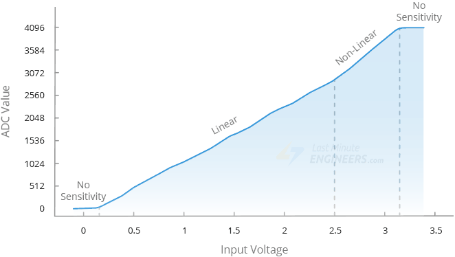
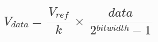

# Conversor Digital-Analgico
Unidada del microcontrolador capaz de convertir una magnitud fisica analogica (Voltaje) en un valor digital capaz de ser interpretado por el microcontrolador.

Cada microcontrolador tiene 2 unidades ADC y cada unidad cuenta con 9 canales, para un total de 18 canales posibles de medición. 
Los pines exactos varian segun la placa elegida.

Soportan hasta 4096 niveles diferenciables (12 bits) y un voltaje maximo de 3.3V. Su resolucion es de 0.8mV por nivel.

## Modos de sampleo
Dos modos **Oneshot** o **Continuo**.

Oneshot: El CPU solicita una conversión, espera y luego lee el resultado. Baja frecuencia y cada conversion es mas costosa en terminos computacionales.

Continuo: La ADC se configura para convertir y almancenar valores de manera continua, el CPU solo necesita leer una posición de memoria. Alta frequencia, no ocupa recursos del CPU, requiere mas setup.

La perilla gira lo suficientemente lento para considerar oneshot, aunque cualquiera de las dos opciones es valida.

## Hardware
La ESP32 contiene una ADC tipo SAR (successive-approximation-register)

## Limitaciones
> **WIFI**:
> Si se usa el modulo de wifi, la ADC2 se vuelve inutilizable.

> **Rango de entrada**: 
> Estas ADC solo soportan voltajes entre 0 y 3.3V

> **No linearidad**: 
> La conversion es no linear, como puede observarse en la siguiente imagen
> 
> No detecta diferencias entre 0 y 0.13V, ni entre 3.2 y 3.3
> Tambien perdemos la linearidad entre 2.5 y 3.2 Volt

%% 
NOTA: Probablemente nos convenga trabajar en el rango entre 0 y 2.5V. Reduce la resolución a 0.6mV por nivel pero reduce la simplicidad de conversión
%%

> **Ruido electronico**:

## Ecuación de conversión

donde 
- `data` es el resultado de la ADC
- `bitwidth` es la resolución en bits de la adc
- `V_ref` es el voltaje de referencia
- `V_data` es el voltaje que estamos midiendo
- `k` es el valor de atenuación

## Referencias
- Documentación oficial de espressif - https://docs.espressif.com/projects/esp-idf/en/latest/esp32/api-reference/peripherals/adc/index.html
- tutorial para implementar una adc - https://randomnerdtutorials.com/esp-idf-esp32-gpio-analog-adc/
- Manual Tecnico de Referencia de la ESP32 - https://documentation.espressif.com/esp32_technical_reference_manual_en.pdf
